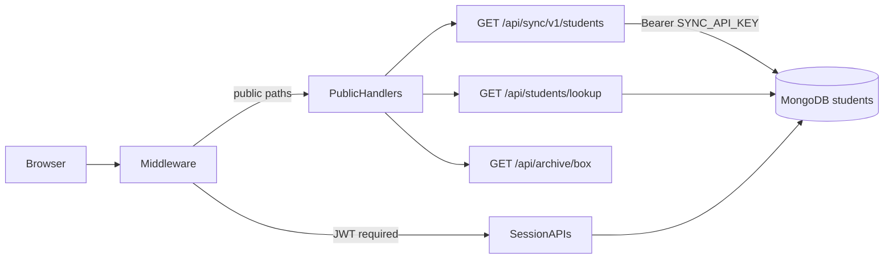
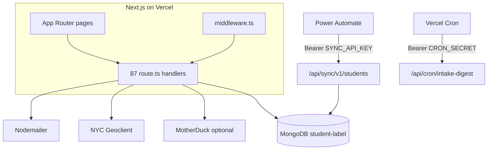

# Codebase Audit: NYC Adult Ed Student Label System

**Date:** 27 August 2026  
**Scope:** `student-label-system/` (git root; Next.js 16 App Router monolith)  
**Method:** Full-repository review of source, config, docs, lockfile, and `npm audit` (21 reported issues: 1 critical, 14 high, 4 moderate, 2 low). No application code was changed.

This system stores **student PII** (names, DOB, address, email, phone, intake notes) for NYC Adult Education (District 79) staff. Security findings are scored with that data class in mind.

---

## 1. Executive Summary

The application is a **production-capable, feature-rich monolith** serving DOE staff at `nycadultedlabels.nyc` (Vercel, school subdomains). Authentication foundations are thoughtful: NextAuth JWT sessions, bcrypt, TOTP MFA, account lockout, NY geo wall, and gitignored secrets. Operational docs (Mintlify, OpenAPI, health probes, Power Automate sync) are unusually strong for a staff-internal app.

The gap is not “no security”; it is **authorization and data minimization lagging behind authentication**. UI role gates are not consistently mirrored on APIs. Public QR endpoints return more PII than the page needs. Several list endpoints load entire collections into memory. There are **zero automated tests** and **no CI**.

### Health check

| Area | Rating | Notes |
|------|--------|--------|
| Authentication | Strong | MFA, lockout, 12h JWT, Azure AD SSO optional |
| Authorization | Weak | Per-route, inconsistent; Intake Member APIs unrestricted |
| PII minimization | Weak | Public lookup spreads the full MongoDB document |
| Input validation | Mixed | Good name/DOB/address checks; no shared schema; unescaped `$regex` |
| Frontend structure | Weak | God-pages (up to 2,860 lines); almost everything is a client component |
| Backend scalability | Mixed | Sync API paginated; dashboard/duplicates unbounded |
| Observability | Weak | `console.error` only; no request IDs |
| Tests / CI | Absent | No `*.test.*`, no `test` script, no GitHub Actions |
| Dependencies | Attention needed | Next.js high CVEs; NextAuth flagged critical; unused `html2canvas` |

### Major strengths

- MFA enrollment gate, forced password change, and idle session guard layered on NextAuth.
- NY geo restriction in production (`src/lib/geoRestrict.ts` + `src/middleware.ts`).
- Secrets not committed (`.gitignore` covers `.env*` and `.sync-api-key.local`).
- Paginated admin student list (`GET /api/admin/students/all`) and cursor-paginated sync export (`GET /api/sync/v1/students`).
- MongoDB connection cache resets on failed `connect()` — correct for Vercel serverless (`src/lib/mongodb.ts`).
- Cabinet moves use a real transaction (`src/lib/cabinetMoves.ts`).
- OpenAPI spec + Swagger UI, liveness/readiness probes, Mintlify docs.

### Top critical priorities

1. **Public QR lookup returns the full student document** — `src/app/api/students/lookup/route.ts`.
2. **Intake Member UI lock does not apply to APIs** — `src/middleware.ts` skips `/api` for that role.
3. **`GET`/`PUT /api/students/[id]` lack school and role checks** — `src/app/api/students/[id]/route.ts`.
4. **Dashboard `GET /api/students` is unpaginated** — loads every in-scope student into the browser.
5. **No automated tests and no CI** — regressions in auth, merge, and ID generation will ship unnoticed.
6. **Patch Next.js / NextAuth / nodemailer** from the current `npm audit` report.

---

## 2. Security & Data Protection



### 2.1 Authentication, authorization, and session management

**How login works**

- NextAuth v4 (`src/lib/authOptions.ts`): Credentials provider + optional Azure AD.
- Session strategy: JWT, `maxAge` 12 hours. Cookies: `httpOnly`, `sameSite: 'lax'`, optional `NEXTAUTH_COOKIE_DOMAIN` for school subdomains (CSRF cookie is **not** `__Host-` bound — documented tradeoff).
- Passwords: bcrypt. MFA: TOTP via `otplib`. Account lockout: 8 failures → 30 minutes (`src/lib/authSecurity.ts`). Auth events stored with IP/UA.
- Middleware (`src/middleware.ts`) enforces: NY geo wall → public-path allowlist → JWT → MFA enrollment → forced password change → Intake Member **page** redirect.

**Roles:** Admin, Data Lead, Data Member, Intake Member. Role checks live almost entirely inside individual route handlers. There is **no** shared `requireRole()` / `assertSchoolAccess()` helper. NextAuth session types are declared in `src/types/next-auth.d.ts`, but ~23 files still use `(session?.user as any)?.role`.

#### Finding A1 — HIGH: Intake Member API bypass

Middleware restricts Intake Members only when `!path.startsWith('/api')`:

```120:133:src/middleware.ts
  // Intake Members: keep them on intake / profile / docs / public pages
  if (token.role === 'Intake Member' && !path.startsWith('/api')) {
    const allowed =
      path.startsWith('/intake') ||
      path.startsWith('/profile') ||
      path.startsWith('/docs') ||
      path.startsWith('/student') ||
      path.startsWith('/archive');
    if (!allowed) {
      return withTenantHeaders(
        NextResponse.redirect(new URL('/intake', req.url)),
      );
    }
  }
```

Docs (`docs/user-roles.mdx`) state Intake Members cannot search, print, or edit existing records. An authenticated Intake Member can still call `GET /api/students`, `PUT /api/students/[id]`, print DOCX routes, cabinet APIs, etc.

**Fix:** Allowlist Intake Member APIs in middleware (`/api/intake/*`, `/api/profile/*`, `/api/auth/*`, `/api/tenant`, `/api/users` self-read if needed). Deny everything else with 403.

#### Finding A2 — HIGH: Student-by-ID GET has no school/role check

`GET /api/students/[id]` is not a public path, so middleware requires a session. After that, **any authenticated user** can fetch **any** student by MongoDB ObjectId — including another school’s record. The handler never compares `student.school` to `session.user.school`.

```28:48:src/app/api/students/[id]/route.ts
export async function GET(req: NextRequest, { params }: { params: Promise<{ id: string }> }) {
  const { id } = await params;
  try {
    if (!isValidObjectId(id)) {
      return NextResponse.json({ error: 'Invalid student ID format' }, { status: 400 });
    }

    const client = await clientPromise;
    const db = client.db("student-label");
    const student = await db.collection('students').findOne({ _id: new ObjectId(id) });
    if (!student) return NextResponse.json({ error: 'Student not found' }, { status: 404 });

    const authSession = await getServerSession(authOptions);
    const schoolIntakeSessions = authSession
      ? await getSchoolIntakeSessions(db, student.school)
      : undefined;

    return NextResponse.json({
      ...student,
      schoolIntakeSessions,
    });
```

#### Finding A3 — HIGH: Student-by-ID PUT has no role or school check

`PUT` reads `userSchool` from the session and never uses it to authorize the update. Any authenticated user (including Intake Member, given A1) can mutate any student. Cabinet count increments on drawer changes are not transactional.

#### Finding A4 — MEDIUM: DELETE is role-gated but not school-scoped

`DELETE` requires Admin or Data Lead, then deletes by `_id` with no `student.school === session.user.school` check. A Data Lead at School A can delete a student at School B if they know the ObjectId.

#### Finding A5 — HIGH: Print routes trust client-supplied student arrays

`POST /api/print/avery5163-docx` (and the 94205 variant) only check `getServerSession`. The body `students` array is not verified against the database or the user’s school/role. An Intake Member (or any session) can generate labels for arbitrary PII they put in the request.

```338:350:src/app/api/print/avery5163-docx/route.ts
export async function POST(req: NextRequest) {
  const session = await getServerSession(authOptions);
  if (!session) return NextResponse.json({ error: 'Unauthorized' }, { status: 401 });
  // ...
  students = body.students ?? [];
```

#### Finding A6 — LOW: CSRF cookie not `__Host-` prefixed

Intentional so cookies work across school subdomains. Acceptable if `SameSite=lax` + HTTPS hold. Do not weaken `sameSite` further.

**Positive controls:** MFA enrollment API allowlist, idle session guard, user list projections strip `password` / `mfaSecret`, destructive seed/clear gated by Admin **and** email allowlist (`src/lib/allowedUsers.ts`).

---

### 2.2 Secret handling, environment variables, and credential leakage

| Control | Status |
|---------|--------|
| `.env*` gitignored | Yes (`.gitignore` line 34) |
| Tracked `.env` in git | Not found |
| Client-exposed secrets (`NEXT_PUBLIC_*` API keys) | None observed — public vars are URLs/domains |
| Hardcoded production secrets in source | None found |
| Hardcoded operational allowlist email | `jjaramillo7@schools.nyc.gov` in `src/lib/allowedUsers.ts` |

#### Finding S1 — MEDIUM: Cron secret accepted as query parameter

```12:19:src/app/api/cron/intake-digest/route.ts
 * Auth: Authorization: Bearer <CRON_SECRET>  (or ?secret=)
// ...
  const querySecret = req.nextUrl.searchParams.get('secret');
  if (!secret || (token !== secret && querySecret !== secret)) {
```

Query secrets leak via access logs, Referer, browser history, and Vercel function logs. Vercel Cron can send `Authorization`. **Remove `?secret=`.**

#### Finding S2 — MEDIUM: Sync and cron secrets compared with `!==`

`src/lib/syncAuth.ts` and the cron route use plain string equality. Use `crypto.timingSafeEqual` on equal-length buffers (hash both sides if lengths may differ).

#### Finding S3 — LOW: Destructive ops keyed to a personal email

`ALLOWED_ADMIN_USERS` is a source-code allowlist of one person. Prefer an env var (`DESTRUCTIVE_ADMIN_EMAILS`) or a DB flag so offboarding does not require a deploy.

#### Finding S4 — INFO: Screenshot credentials in `.env.example`

`DOCS_SCREENSHOT_EMAIL` / `PASSWORD` / `MFA` are optional and gitignored at runtime. Keep them out of production Vercel env.

**Env surface (names only):** `MONGODB_URI`, `NEXTAUTH_SECRET`, `NEXTAUTH_URL`, `SYNC_API_KEY`, `CRON_SECRET`, `AZURE_AD_*`, `NYC_GEOCLIENT_*`, `MOTHERDUCK_*`, `EMAIL_SERVER`, `EMAIL_VALIDATION_API_KEY`. Production example also documents `SYNC_API_KEY` which the local `.env.example` does not — keep the two files aligned.

---

### 2.3 Input validation, sanitization, and API route safety

There is **no Zod / Valibot / shared request schema**. Validation is ad hoc: `usaNameError`, BE/ESL age checks, address normalization, intake session times. That domain validation is real and useful; it does not cover operator injection or payload shape.

#### Finding V1 — MEDIUM: Unescaped `$regex` from user input

Dashboard search correctly uses `escapeRegex()` in `src/lib/studentSearch.ts`. Admin search does not:

```200:206:src/app/api/admin/students/all/route.ts
  if (search) {
    const re = { $regex: search, $options: 'i' };
    filter.$or = [
      { firstName: re }, { lastName: re },
      { email: re },
      { labelId: re }, { studentId: re },
    ];
  }
```

Same pattern in `src/app/api/students/email-list/route.ts` (`$regex: q`). Risk: regex metacharacters, ReDoS, and unexpected match sets. **Reuse `escapeRegex` (export it from `studentSearch.ts`).**

#### Finding V2 — CRITICAL/HIGH: Public lookup returns the entire student document

```73:84:src/app/api/students/lookup/route.ts
    return NextResponse.json({
      ...student,
      _id: student._id.toString(),
      cabinetName,
      drawerName,
      archiveBoxLabel: student.archiveBoxLabel || null,
      archiveLocation: student.archiveLocation || null,
      archiveSchoolYear: student.archiveSchoolYear || null,
      archiveBoxId: student.archiveBoxId || null,
      siblings,
    });
```

The comment says “fields needed for the student details page.” The implementation spreads notes, email, phone, address, geoclient metadata, intake visits, `createdBy`, sibling IDs, etc. Label IDs are printed on physical labels (`{year}-{initials}-{7-digit-seq}`) and are **partially enumerable**. Capability-URL design is acceptable for a kiosk QR page **if** the JSON is a tight whitelist.

Public archive box lookup (`src/app/api/archive/box/route.ts`) is better (projected fields) but still unauthenticated names + DOB for every student in a box.

#### Finding V3 — MEDIUM: Unauthenticated deep health probe

`GET /api/health/deep` is public. It returns Mongo latency, missing env **names**, estimated student count, and a hint that sync uses `Authorization: Bearer <SYNC_API_KEY>`. Useful for operators; useful for attackers. Gate it (admin session, internal network, or disable in production). Keep `GET /api/health` public for Docker/Vercel.

#### Finding V4 — LOW: Error `details` leak internals

`PUT`/`DELETE` on students return `details: error.message` on 500. Mongo/driver messages can expose query shape. Return a generic message; log the rest server-side.

#### Finding V5 — LOW: Password policy is length-only

`src/app/api/profile/password/route.ts` requires `newPassword.length < 8` only. No complexity, no breach-password check. MFA mitigates credential stuffing; a slightly stronger policy is still warranted for a PII system.

**XSS:** One `dangerouslySetInnerHTML` in `src/components/ui/chart.tsx` (theme CSS, not user HTML). Student pages render React text nodes. Residual risk is stored XSS if a future page interpolates notes unsafely.

**CSRF:** `SameSite=lax` session cookies block most cross-site POSTs. NextAuth CSRF tokens cover auth endpoints. Other JSON mutations rely on same-site. Do not add CORS `Access-Control-Allow-Origin: *` with credentials.

**NoSQL:** No `$where` / user-controlled operators found. Unescaped `$regex` is the main injection vector.

**Rate limiting:** None in application code. Docs mention Vercel Firewall for `/api/auth`. Public lookup, login, and sync have no app-level throttle. Lockout covers credential brute force only after 8 failures **per account**.

**Security headers:** `next.config.ts` is empty — no CSP, `X-Frame-Options` / `frame-ancestors`, `X-Content-Type-Options`, `Referrer-Policy`, or HSTS (Vercel may add some at the edge; do not assume CSP).

---

### 2.4 Dependency vulnerabilities and outdated packages

`npm audit` on 27 Aug 2026 (lockfile as committed):

| Severity | Count |
|----------|-------|
| Critical | 1 |
| High | 14 |
| Moderate | 4 (report text) / 11 (JSON metadata) |
| Low | 2 |
| **Total reported** | **21** (human report) / **28** (JSON vuln nodes) |

Locked versions of first-party packages:

| Package | Declared | Locked |
|---------|----------|--------|
| `next` | `^16.2.6` | **16.2.6** |
| `eslint-config-next` | `16.0.3` | **16.0.3** (skew vs Next 16.2) |
| `next-auth` | `^4.24.13` | **4.24.14** |
| `nodemailer` | `^7.0.13` | **7.0.13** |
| `swagger-ui-react` | `^5.32.6` | **5.32.6** |
| `html2canvas` | `^1.4.1` | **1.4.1** (unused in `src/`) |

#### Production-path (treat first)

1. **`next@16.2.6` — high.** Advisories include App Router middleware/proxy bypass under Turbopack + single locale (`GHSA-6gpp-xcg3-4w24`), Server Action DoS/SSRF, cache confusion, image-optimization DoS, unauthenticated Server Function endpoint disclosure. **This app’s entire session gate is middleware.** Upgrade Next to the patched 16.3.x (or whatever `npm audit fix` resolves) and re-test auth redirects. Align `eslint-config-next` to the same major.minor.

2. **`next-auth@4.24.14` — critical (Auth.js advisory family).** Reported issues: Unicode homoglyph `@` in email normalizer (`GHSA-7rqj-j65f-68wh`), `getToken()` throw on malformed Bearer (`GHSA-xmf8-cvqr-rfgj`), OAuth state/nonce/PKCE cookies not bound to the provider (`GHSA-x445-f3h2-j279`). This app uses **Credentials + Azure AD**, not the Email magic-link provider; the homoglyph issue is lower likelihood here. Middleware **does** call `getToken()`. Azure AD **is** affected by unbound OAuth cookies if SSO is enabled. Plan: upgrade to a patched NextAuth 4.x if one exists; otherwise isolate SSO and add regression tests. Do not jump to Auth.js v5 without a dedicated migration.

3. **`nodemailer@7.0.13` — high.** SMTP/CRLF injection and related issues. Digest emails and lockout alerts go through this. `npm audit fix --force` wants 9.x (breaking). Pin a patched 7.x if available; otherwise upgrade carefully and keep envelope/headers fully server-controlled (they already are).

4. **`swagger-ui-react@5.32.6` — high** via `immutable` / `js-yaml`. Only loaded on `/docs/api` (dynamic import). Upgrade Swagger UI; it is not on the student-data path but it is authenticated-staff-facing.

#### Mostly transitive / CLI / build

- **`hono` / `@hono/node-server` (high/moderate)** — pulled by `shadcn` CLI, not the Next runtime. Still run `npm audit fix` so the lockfile is clean.
- **`axios` (high)** — typically Swagger/tooling, not app `fetch`.
- **`postcss@8.5.14` (high)** — pinned via `overrides`; audit wants `8.5.26`. Build-time source-map file read; lower runtime risk. Update the override.
- **`brace-expansion`, `nanoid`, `form-data`, `fast-uri`, `sharp`, `dompurify`** — mix of Next/Swagger/docx trees. Prefer `npm audit fix` without `--force` first.

**Unused production dependency:** `html2canvas` is in `package.json` and **never imported** under `src/`. Remove it.

**Framework note:** NextAuth v4 is in maintenance; a future Auth.js v5 migration is technical debt, not an emergency if 4.x patches land.

---

## 3. Frontend Architecture & UX

### 3.1 Component structure, reusability, and state management

**Stack:** Next.js 16 App Router, React 19, Tailwind 3.4, shadcn/Radix, next-auth/react. ~40 routes, ~96 components, **108 `'use client'` files**.

Shell: `src/app/layout.tsx` → `Providers` → `AppShell` → `AppSidebar` / `AppTopBar`. Navigation config in `src/lib/navConfig.ts`. Intake is kiosk-mode (excluded from shell). Public QR pages: `/student/[studentId]`, `/archive/box/[boxId]`.

**No global client store** (no Zustand/Redux). Pattern is local `useState` + `useEffect` + `fetch`. Shared pieces: `useAppSettings` (module cache), intake draft `localStorage`, print layout `localStorage`.

#### God-components

| File | Lines | Problem |
|------|------:|---------|
| `src/app/admin/cabinets/page.tsx` | 2,860 | CRUD, archive, floor map, labels, modals in one file |
| `src/app/admin/students/bulk-upload/page.tsx` | 1,706 | Parse, validate, geocode, preview, submit |
| `src/app/intake/page.tsx` | 1,552 | Orchestration still huge despite extracted cards |
| `src/app/page.tsx` | 1,167 | Dashboard fetch + filter + print + archive + modals |
| `src/app/admin/users/page.tsx` | 1,144 | Users, security, bulk upload, intake sessions |
| `src/app/admin/settings/page.tsx` | 1,068 | Settings + stats + dev tools |
| `src/components/PrintView.tsx` | 646 | Print portal, templates, barcodes, DOCX |

#### Dead / stub UI

- `src/components/Header.tsx` (211 lines) — unused; superseded by `AppTopBar`.
- `src/components/Navigation.tsx` — re-exports deprecated `AdminHeader`.
- `src/components/ContentWrapper.tsx`, `src/components/AppHeaderWrapper.tsx` — no-op stubs.

#### Duplication

- `FISCAL_YEAR_OPTIONS` copied across dashboard, bulk-upload, `EditStudentModal`, `BulkUpdateModal`, cabinets, while `SchoolConfigForm` uses `getFiscalYearOptions()`.
- `STATUS_OPTIONS` disagree: `EditStudentModal` / `BulkUpdateModal` omit Withdrawn / Pending / Transferred / Other that the dashboard allows.
- Command palette hardcodes tool links instead of deriving from `NAV_GROUPS` (`src/lib/navConfig.ts`).
- Analytics vs MotherDuck analytics pages share chart/metric/skeleton structure.
- Role-guard `useEffect` + `router.push('/auth/signin')` copied across ~15 pages (also duplicated with middleware).

**Server vs client:** `about/page.tsx` is `'use client'` with no hooks. `PageIntro.tsx` is presentational. Public student/archive pages fetch in the client; they should be server components that load data and pass props. `src/app/docs/page.tsx` is already a good server-component example.

---

### 3.2 Performance bottlenecks

- **Dashboard loads the full student set** via `GET /api/students` (no pagination unless `?search=`), then filters and paginates in the browser (`src/app/page.tsx`). Contrast: `admin/students/all` uses `page`/`limit`.
- **Command palette** fetches `/api/students` on open (`src/components/CommandPalette.tsx` lines 91–107) and swallows errors (`catch { // ignore }`).
- **Zero `React.memo`.** `StudentTable` re-renders barcodes (`react-barcode`) per row on parent updates.
- **No list virtualization.**
- Heavy libraries loaded with the page, not on interaction: `recharts` (analytics), `mdb-reader` + `buffer` (legacy roster upload), `@zxing/library` (scanner), `jspdf`. Exception: `ApiDocsSwagger.tsx` correctly uses `dynamic(..., { ssr: false })`.
- `next/image` used only on the sign-in page. QR/barcodes are SVG/canvas — acceptable.
- `next.config.ts` has no bundle analyzer, no `experimental.optimizePackageImports` for `lucide-react`.

As district roster size grows, the dashboard and command palette will be the first UX/timeout failures.

---

### 3.3 Accessibility, responsive design, and UI error handling

**Strengths:** Radix dialogs/selects (focus trap), labeled sign-in form, some `aria-label` / `sr-only` on top-bar and table row menus, sidebar `aria-label="Main"`, command palette arrow-key navigation, Tailwind `sm:`/`md:`/`lg:` used widely, tables wrapped in `overflow-x-auto`.

**A11y gaps**

- Icon-only buttons without `aria-label`: cabinets page actions, label-stock history/edit/delete, public student/archive back buttons, `BarcodeScanner` camera toggle, `SavedSearches` delete.
- `StudentTable` sort headers are clickable `<th>` elements — no `tabIndex`, `onKeyDown`, or `aria-sort`.
- No skip-to-main-content link; `<main>` in `AppShell` has no stable `id`.
- Google Translate widget: no `aria-label` on the container; label hidden below `md:`.
- Public student not-found uses a 🔍 emoji as the visual cue (`src/app/student/[studentId]/page.tsx`).
- Widespread `text-[10px] text-muted-foreground` — likely fails WCAG AA at that size.
- Intake address status badges use light-only greens (`bg-green-100 text-green-700`) that may fail in dark mode.
- Barcode preview in `StudentTable` is hover-only (not keyboard/touch).

**Responsive risks:** Dashboard action bars and cabinet card action clusters will overflow on narrow phones. `table-fixed` columns truncate heavily.

**Error handling**

- **No** `src/app/error.tsx`, **no** `loading.tsx`, **no** React error boundary component.
- `Suspense` on only ~4 of ~40 pages.
- Public student page can return `null` after load (blank screen).
- Fetch failures are generic strings with no retry control on most admin pages.
- Intake submit has `submitting` + duplicate dialog (good); many admin forms lack double-submit guards.

---

## 4. Backend & Architecture



### 4.1 API design, querying, and caching

**87** `route.ts` files under `src/app/api/`. REST-ish resources with RPC-style POSTs (`/api/admin/duplicates` `action: merge|undo`). Auth tiers: public, session cookie, `SYNC_API_KEY`, `CRON_SECRET`. OpenAPI at `src/lib/openapi/spec.ts` (seed/wipe omitted — good).

**Inconsistency:** Session/role checks copy-pasted; some routes use typed `session.user.role`, others `as any`. Response shape is usually `{ error: string }`; no correlation IDs.

**Orphan endpoint:** `GET /api/admin/duplicate-students` is documented in OpenAPI/README and has **no UI caller**. Live workflow is `/api/admin/duplicates`. Different algorithms; both can load large in-memory sets.

**Destructive routes still in the production app** (session + allowlist, not in OpenAPI): `seed-test-data`, `seed-cabinets`, `clear-all-data`, `migrate/drawers`, `users/migrate`, `admin/migrate-student-ids`. Prefer scripts-only or `NODE_ENV !== 'production'` guards.

#### Querying

| Location | Pattern | Risk |
|----------|---------|------|
| `GET /api/students` | `find(query).toArray()` — limit 20 **only if** `?search=` | Unbounded school/district dump |
| `GET /api/admin/duplicates` | All non-archived students, pairwise in process | Memory / timeout |
| `GET /api/admin/duplicate-students` | Full scan | Same; orphaned |
| `GET /api/admin/cabinet-health` | Cabinets + students `find().toArray()` | Unbounded |
| `GET /api/admin/unassigned-students` | Same | Unbounded |
| `GET /api/admin/data-cleanup` | Unbounded `students.find` | Unbounded |
| `src/lib/cabinetNames.ts` | Loads all cabinets to enrich lists | Extra work per request |

**Good counterexample:** `GET /api/admin/students/all` — `page`/`limit` (max 500), filters, CSV export.

**Indexes:** Created in scripts (`scripts/setup-students-sync.ts`) and a few libs (`searchAnalytics.ts`, `labelStock.ts`), **not** at app startup. Likely missing compound `{ school: 1, archived: 1 }` used on almost every Data Lead query. Regex `$or` searches will not use a text index.

**Caching:** No `unstable_cache` / Redis. Client module cache only in `useAppSettings`. Geoclient uses `cache: 'no-store'`.

**Transactions:** Only `src/lib/cabinetMoves.ts`. Student create + cabinet increment, duplicate merge, bulk upload, and `PUT` drawer moves can partially succeed.

---

### 4.2 Error handling, logging, and edge-case resilience

**Logging:** `console.error` / `console.log`. No pino/winston, no request ID, no PII-redaction policy. Search events log raw query strings (`src/lib/searchAnalytics.ts`) — may contain names/DOB.

**Swallowed errors**

- `POST /api/search-events` — `catch { return 500 }` with **no log**.
- Lookup cabinet/sibling resolution — empty `catch`.
- Command palette student fetch — ignore.

**Unhandled:** `GET /api/admin/duplicates` has been observed without a top-level try/catch (DB errors become opaque 500s).

**Resilience strengths:** Geo wall, MFA/password gates, lockout, Mongo reconnect-on-failure, sync cursor `limit` max 1000, Docker `HEALTHCHECK` on `/api/health`, intake draft autosave.

**Resilience gaps:** No rate limits; cron digest caps at 500 students (may miss issues); bulk operations without transactions; `clear-all-data` has no confirmation token beyond the UI checkbox + email allowlist.

**Public path inventory** (middleware `isPublicPath`): `/auth`, `/geo-blocked`, `/student`, `/archive`, `/docs`, `/api/auth`, `/api/students/lookup`, `/api/archive`, `/api/health`, `/api/sync`, `/api/cron/`, `/api/tenant`, `/api/openapi.json`. `/api/sync` and `/api/cron/` still authenticate inside the handler — correct — but a missing check on a new file under those prefixes would be immediately public.

---

## 5. Code Quality & Maintainability

### 5.1 TypeScript, linting, dead code, technical debt

- `tsconfig.json`: `strict: true`, `@/*` → `./src/*`.
- `eslint.config.mjs`: `next/core-web-vitals` + `next/typescript` only. **No** `@typescript-eslint/no-explicit-any`. **`eslint-config-next@16.0.3` vs `next@16.2.6`.**
- **~89 `as any` line matches** in `src/`; additional `Record<string, any>` and untyped Mongo documents. Worst clusters: duplicates, data-cleanup, cabinet-health, seed-cabinets.
- `@ts-ignore` on Avery DOCX print routes (`avery5163-docx`, `avery94205-docx`).
- **No TODO/FIXME in `src/`** (only vendor skill docs).
- Dead: `Header.tsx`, navigation stubs, `html2canvas`, orphan `duplicate-students` API, `scripts/add-user.js` if still present beside `add-user.ts`.
- Duplicate cabinet map builders: `buildCabinetMap` in admin students/all vs `cabinetNames.ts`.

Typed NextAuth exists (`src/types/next-auth.d.ts`) and is underused. Introducing `StudentDoc` / `CabinetDoc` in `src/types/` plus `requireSession({ roles, school })` would remove most `any` and most auth bugs at once.

---

### 5.2 Test coverage gaps

| Layer | Status |
|-------|--------|
| Unit (`*.test.ts` / `*.spec.ts`) | **0 files** |
| `package.json` `test` script | **Missing** |
| Jest / Vitest config | **Missing** |
| Playwright as E2E suite | **Missing** (used only in `scripts/capture-*-screenshots.cjs`) |
| GitHub Actions | **No `.github/workflows/`** |
| Lint in CI | **Not automated** (`npm run lint` exists locally) |

**Highest-value missing tests**

1. Auth: lockout, MFA enroll gate, Intake Member API 403, Azure domain allowlist.
2. `src/lib/studentId.ts` — label/student ID generation uniqueness.
3. `src/app/api/intake/check/route.ts` — duplicate detection.
4. `src/app/api/admin/duplicates/route.ts` — merge + undo.
5. `src/lib/syncStudent.ts` + cursor pagination.
6. `src/lib/cabinetMoves.ts` — transaction rollback.
7. `src/lib/bulkUploadValidation.ts`.
8. Public lookup **field whitelist** (so a future `...student` cannot regress).
9. E2E: sign-in → intake submit → dashboard search → print DOCX (staff happy path).

Without CI, even a small Vitest suite will rot unless GitHub Actions runs `lint` + `test` + `build` on every PR.

---

## 6. Actionable Roadmap

Check items as they are completed. Paths are relative to `student-label-system/`.

### High

- [ ] **Whitelist public student JSON.** In `src/app/api/students/lookup/route.ts`, stop spreading `...student`. Return only fields the public page renders (name, labelId, cabinet/drawer names, archive box label). Add a unit test that fails if extra keys appear.
- [ ] **Lock Intake Member APIs in middleware.** In `src/middleware.ts`, when `token.role === 'Intake Member'` and `path.startsWith('/api')`, allow only `/api/auth`, `/api/intake`, `/api/profile`, `/api/tenant` (and any genuinely required self-service user route). Return 403 otherwise.
- [ ] **School- and role-scope student-by-id.** In `src/app/api/students/[id]/route.ts`: require session on GET; Admin sees all; others must match `student.school`; PUT limited to Data Lead/Admin/Data Member as product requires; DELETE already role-gated — add school match for non-Admin.
- [ ] **Do not trust print payloads.** In `src/app/api/print/avery5163-docx/route.ts` and `avery94205-docx/route.ts`, accept IDs (not full PII), load students from Mongo, and enforce school/role. Reject Intake Member.
- [ ] **Paginate `GET /api/students`.** Mirror `src/app/api/admin/students/all/route.ts` (`page`, `limit`, max cap). Update `src/app/page.tsx` and `src/components/CommandPalette.tsx` to search via `?search=` (already limited to 20) instead of downloading the roster.
- [ ] **Patch dependencies.** Upgrade `next` off 16.2.6 to the audit-fixed release; set `eslint-config-next` to match; upgrade `next-auth` / `nodemailer` / `swagger-ui-react` per `npm audit`; bump `overrides.postcss` to ≥ 8.5.26; remove unused `html2canvas`. Re-run `npm audit` and auth smoke tests.
- [ ] **Add CI.** Create `.github/workflows/ci.yml`: `npm ci`, `npm run lint`, `npm test` (once added), `npm run build`. Block merge on failure.
- [ ] **Seed a test runner.** Add Vitest (or Jest) and `package.json` `"test"`. First specs: lookup field whitelist, `escapeRegex`, `studentId` generation, Intake Member middleware allowlist (extract helpers to `src/lib` so they are testable without Next runtime if needed).

### Medium

- [ ] **Export and reuse `escapeRegex`.** Move it out of `src/lib/studentSearch.ts` (currently file-private) and use it in `src/app/api/admin/students/all/route.ts` and `src/app/api/students/email-list/route.ts`. Grep for `$regex:` to catch stragglers.
- [ ] **Cron: Bearer only.** Delete `?secret=` handling in `src/app/api/cron/intake-digest/route.ts`. Confirm `vercel.json` cron sends `Authorization`.
- [ ] **Protect `/api/health/deep`.** Require Admin session or a dedicated probe secret. Keep `src/app/api/health/route.ts` public. Strip `hints.syncTest` Bearer documentation from unauthenticated responses.
- [ ] **Security headers.** In `next.config.ts`, set `headers()` for CSP (start report-only), `X-Content-Type-Options: nosniff`, `Referrer-Policy: strict-origin-when-cross-origin`, `frame-ancestors 'none'` (or allow only if you embed).
- [ ] **Shared auth helper.** Add `src/lib/requireSession.ts` (`requireSession`, `requireRole`, `assertSchoolAccess`) and migrate the 77 handlers that call `getServerSession`. Kill `(session?.user as any)`.
- [ ] **Archive box public JSON.** Review `src/app/api/archive/box/route.ts` — consider dropping DOB from the unauthenticated payload; require a signed box token if boxes are widely QR-posted.
- [ ] **Rate limit** `/api/auth/*`, `/api/students/lookup`, `/api/sync/v1/students` (Vercel Firewall + optional in-app token bucket for lookup).
- [ ] **Indexes at boot or migrate script in deploy.** Compound `{ school: 1, archived: 1 }`, `{ labelId: 1 }` sparse unique, `{ studentId: 1 }` sparse unique. Document in `scripts/setup-students-sync.ts` and run from CI/deploy.
- [ ] **Paginate or stream admin scans.** `src/app/api/admin/duplicates/route.ts`, `cabinet-health`, `unassigned-students`, `data-cleanup` — do not `find().toArray()` the whole school.
- [ ] **`error.tsx` / `loading.tsx`.** Add `src/app/error.tsx` and `src/app/loading.tsx`; nest under `src/app/admin/` if admin errors should differ.
- [ ] **Centralize student option constants.** One `src/lib/studentOptions.ts` for fiscal years, statuses, Avery templates. Fix `EditStudentModal` missing statuses.
- [ ] **Derive Command Palette from `navConfig.ts`.** Remove the second nav map in `src/components/CommandPalette.tsx`.
- [ ] **Dynamic import** `recharts`, `@zxing/library`, `mdb-reader` on the pages that need them.
- [ ] **Delete or feature-flag** `src/app/api/admin/duplicate-students/route.ts`; remove from `src/lib/openapi/spec.ts` if deleted.
- [ ] **Guard destructive HTTP routes** in production (`clear-all-data`, `seed-*`, migrate). Prefer CLI scripts already in `scripts/`.
- [ ] **Structured logging** (request id + route + user school/role; never log full student docs or passwords). Log the empty `catch` in `search-events`.
- [ ] **Transactions** for student create + cabinet `$inc`, duplicate merge, and `PUT` drawer moves (pattern already in `src/lib/cabinetMoves.ts`).

### Low

- [ ] **Timing-safe compare** for `SYNC_API_KEY` in `src/lib/syncAuth.ts` and cron Bearer token.
- [ ] **Move `ALLOWED_ADMIN_USERS` to env** (`src/lib/allowedUsers.ts`).
- [ ] **Password policy** beyond length 8 (`src/app/api/profile/password/route.ts`).
- [ ] **Remove dead UI:** `src/components/Header.tsx`, `Navigation.tsx`, `AdminHeader.tsx`, `ContentWrapper.tsx`, `AppHeaderWrapper.tsx`. Remove `scripts/add-user.js` if `add-user.ts` is canonical.
- [ ] **Convert `src/app/about/page.tsx` and `src/components/PageIntro.tsx` to server components.**
- [ ] **Server-fetch** `src/app/student/[studentId]/page.tsx` and `src/app/archive/box/[boxId]/page.tsx`.
- [ ] **A11y pass:** `aria-label` on icon buttons (cabinets, label-stock, public back, scanner, saved searches); make `StudentTable` sort headers `<button>` with `aria-sort`; skip link targeting `<main id="main-content">`; replace emoji-only empty states.
- [ ] **Enable `@typescript-eslint/no-explicit-any` as warn**, then error, after `StudentDoc` types exist.
- [ ] **Align OpenAPI** (`additionalProperties: true` everywhere) with real response shapes once DTOs exist.
- [ ] **Idle timeout vs JWT maxAge** — document in `docs/admin/security.mdx` so operators know 12h hard cap vs client idle guard.
- [ ] **Split god-pages** starting with `src/app/admin/cabinets/page.tsx` (extract map, archive modal, label print). Not a security fix; it is how A1–A5 keep coming back.

---

## Appendix: Key file index

| Concern | Path |
|---------|------|
| Middleware / public paths | `src/middleware.ts` |
| NextAuth | `src/lib/authOptions.ts`, `src/lib/authSecurity.ts`, `src/lib/mfa.ts` |
| Session types | `src/types/next-auth.d.ts` |
| Public PII | `src/app/api/students/lookup/route.ts`, `src/app/api/archive/box/route.ts` |
| Student CRUD authz | `src/app/api/students/[id]/route.ts`, `src/app/api/students/route.ts` |
| Sync auth | `src/lib/syncAuth.ts`, `src/app/api/sync/v1/students/route.ts` |
| Cron | `src/app/api/cron/intake-digest/route.ts`, `vercel.json` |
| Deep health | `src/app/api/health/deep/route.ts` |
| Regex search | `src/lib/studentSearch.ts`, `src/app/api/admin/students/all/route.ts` |
| Print | `src/app/api/print/avery5163-docx/route.ts` |
| Mongo | `src/lib/mongodb.ts` |
| Destructive allowlist | `src/lib/allowedUsers.ts` |
| ESLint / Next config | `eslint.config.mjs`, `next.config.ts` |
| Nav | `src/lib/navConfig.ts`, `src/components/CommandPalette.tsx` |

---

*This document is an audit snapshot, not a penetration-test report. Fixes should be implemented and re-verified (especially middleware, lookup whitelist, and Next.js upgrade) before treating High items as closed.*
