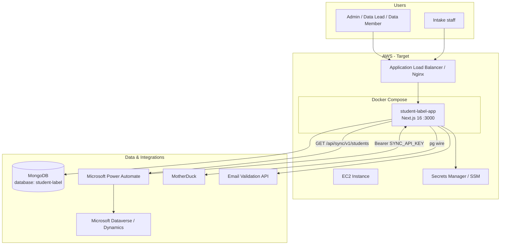

# Student Label System — Architecture & AWS EC2 Deployment Guide

**Document purpose:** Share with AWS solutions architects / support to plan deployment of the **District 79 Adult Education Student Label System** on **Amazon EC2** using **Docker** and **Docker Compose**.

**Repository:** `student-label-system` (Next.js monolith)  
**Current production:** Vercel (`https://nycadultedlabels.nyc`)  
**Target production:** AWS EC2 instance(s) behind HTTPS, containerized with Docker Compose

---

## 1. Executive summary

The Student Label System is a **web application for managing adult-education student records**, physical file placement (cabinets/drawers/archive boxes), label printing, intake workflows, and admin reporting. It is built as a **single Next.js 16 application** with **API routes** (no separate backend service). All persistent data lives in **MongoDB** (database name: `student-label`).

The app is **stateless at the application layer** — session state is stored in **HTTP cookies** (NextAuth JWT). The only hard dependency is **MongoDB**. Optional integrations include **Microsoft Power Automate** (student sync to Dynamics/Dataverse), **MotherDuck** (analytics warehouse), and a third-party **email validation API**.

For AWS EC2 deployment, we recommend:

| Layer | Recommendation |
|-------|----------------|
| Compute | EC2 (Amazon Linux 2023 or Ubuntu 22.04), Docker + Docker Compose |
| App container | Next.js production build (`next build` → `next start` or standalone output) |
| Database | **MongoDB Atlas** (keep existing) **or** self-managed MongoDB on a separate EC2/EBS volume |
| TLS | Application Load Balancer (ALB) + ACM certificate **or** Nginx + Let's Encrypt on EC2 |
| Secrets | AWS Secrets Manager or SSM Parameter Store |
| Logs | CloudWatch Logs (Docker `awslogs` driver) |
| Backups | MongoDB Atlas backups **or** EBS snapshots for self-hosted MongoDB |

---

## 2. System context diagram



---

## 3. Application architecture

### 3.1 Pattern

| Aspect | Detail |
|--------|--------|
| Architecture style | **Monolithic Next.js App Router** (UI + REST API in one process) |
| Runtime | **Node.js 20 LTS** (recommended) |
| Framework | Next.js 16, React 19, TypeScript |
| Auth | **NextAuth.js v4** — Credentials provider, JWT sessions, optional TOTP MFA |
| Database | **MongoDB 6.x** via official `mongodb` Node driver (no ORM) |
| Styling | Tailwind CSS, shadcn/ui (Radix) |
| API docs | OpenAPI 3.0 at `/api/openapi.json`, Swagger UI at `/docs/api` |

There is **no Redis**, **no message queue**, and **no separate worker process** in the current codebase. Background-style work (Power Automate sync, email validation batches) is triggered by **external schedulers** or **admin UI actions** calling HTTP endpoints.

### 3.2 Major functional modules

| Module | Routes / pages | Description |
|--------|----------------|-------------|
| Authentication | `/auth/signin`, `/api/auth/*` | Email/password login, MFA, session cookies |
| Student intake | `/intake`, `/api/intake/*` | Public/staff intake form, session lookup |
| Student CRUD | `/api/students`, `/admin/students/*` | Create, update, bulk upload, lookup |
| Physical storage | `/admin/cabinets`, `/api/cabinets/*` | Cabinets, drawers, capacity, archive boxes |
| Label printing | `/api/print/*`, print history | Avery 5163 DOCX, barcode labels |
| Admin & reports | `/admin/*`, `/reports`, `/audit` | Enrollment, duplicates, cabinet health, activity |
| School config | `/admin/schools/*` | Schools, intake sessions, fiscal year |
| User management | `/admin/users`, `/api/users/*` | Roles: Admin, Data Lead, Data Member |
| Sync export | `/api/sync/v1/students` | Machine-to-machine delta export for Power Automate |
| Health & ops | `/api/health`, `/api/health/deep`, `/admin/settings` | Liveness, readiness, system stats |
| Analytics | `/admin/analytics` | Live MongoDB metrics (Admin / Data Lead) |
| MotherDuck analytics (optional) | `/admin/motherduck-analytics` | Warehouse sync + DuckDB SQL via Postgres wire |

### 3.3 API surface (59 route handlers)

Grouped by authentication model:

| Auth model | Examples | Caller |
|------------|----------|--------|
| **None** (public) | `/api/health`, `/api/openapi.json` | Load balancers, monitors |
| **NextAuth session** (cookie) | `/api/students`, `/api/cabinets`, most `/api/admin/*` | Browser users |
| **Bearer `SYNC_API_KEY`** | `/api/sync/v1/students` | Power Automate, integrations |

Full route list lives under `src/app/api/` in the repository.

---

## 4. Data layer (MongoDB)

### 4.1 Connection

- **Environment variable:** `MONGODB_URI` (required at startup — app throws if missing)
- **Database name:** `student-label` (hardcoded in application code)
- **Driver:** Singleton `MongoClient` promise (`src/lib/mongodb.ts`)

### 4.2 Primary collections

| Collection | Purpose | Approx. scale (production snapshot) |
|------------|---------|-------------------------------------|
| `students` | Core student records, placement, archive metadata | ~4,400 documents |
| `cabinets` | Cabinet/drawer structure and capacity counts | ~3 documents |
| `users` | Login accounts (bcrypt passwords, MFA secrets) | ~10 documents |
| `school_config` | Per-school intake settings, agency IDs | Custom + defaults |
| `audit_logs` | User action audit trail | Low volume |
| `print_history` | Label print events | Low volume |
| `app_settings` | Global feature toggles (dev tools visibility) | 1 document |
| `sync_export_log` | Last Power Automate export timestamps | Grows slowly (90-day retention) |

### 4.3 Indexes (students — sync-critical)

The sync API relies on `updatedAt` for delta queries. Recommended indexes (see `scripts/setup-students-sync.ts`):

- `{ updatedAt: 1, _id: 1 }` — cursor pagination for sync
- `{ studentId: 1 }` — lookups
- `{ school: 1 }` — school-scoped queries

### 4.4 MongoDB hosting options on AWS

| Option | Pros | Cons |
|--------|------|------|
| **Keep MongoDB Atlas** (current) | No migration, managed backups, VPC peering to EC2 | External dependency, Atlas cost |
| **Self-hosted MongoDB on EC2 + EBS** | Full control, same VPC | Ops burden, backup/HA you manage |
| **Amazon DocumentDB** | AWS-managed | **Not recommended** — app uses native MongoDB driver features; verify compatibility first |

**Recommendation for AWS migration:** Start with **Atlas + EC2 app only** (simplest). Move MongoDB to AWS only if policy requires it.

---

## 5. External integrations

| Integration | Direction | Protocol | Config env vars |
|-------------|-----------|----------|-----------------|
| **MongoDB** | App → DB | MongoDB wire protocol | `MONGODB_URI` |
| **Power Automate → App** | Inbound HTTP | REST JSON | `SYNC_API_KEY` |
| **MotherDuck warehouse** | App → MotherDuck | Postgres wire (`pg`) | `MOTHERDUCK_TOKEN`, `MOTHERDUCK_DATABASE`, `MOTHERDUCK_HOST` |
| **Email validation** | App → external API | HTTPS + API key header | `EMAIL_VALIDATION_API_KEY` |
| **SMTP (optional)** | App → mail server | SMTP | `EMAIL_SERVER`, `EMAIL_FROM` |

Power Automate calls nightly:

```http
GET /api/sync/v1/students?since=<ISO8601>&limit=500
Authorization: Bearer <SYNC_API_KEY>
```

Response: paginated student DTOs with `nextCursor` for continuation.

---

## 6. Environment variables

### 6.1 Required for production

| Variable | Description |
|----------|-------------|
| `MONGODB_URI` | MongoDB connection string (include TLS params for Atlas) |
| `NEXTAUTH_SECRET` | Random secret for signing JWT session cookies |
| `NEXTAUTH_URL` | Public URL of the app, e.g. `https://labels.district79.example.gov` |
| `NODE_ENV` | Set to `production` |

### 6.2 Strongly recommended

| Variable | Description |
|----------|-------------|
| `NEXT_PUBLIC_APP_URL` | Same as public URL — used in printed labels and links |
| `SYNC_API_KEY` | Bearer token for `/api/sync/v1/students` (Power Automate) |

### 6.3 Optional integrations

| Variable | Description |
|----------|-------------|
| `EMAIL_VALIDATION_API_KEY` | Third-party email validation |
| `EMAIL_SERVER` / `EMAIL_FROM` | SMTP for transactional email |
| `MOTHERDUCK_TOKEN` | MotherDuck access token |
| `MOTHERDUCK_DATABASE` | MotherDuck database name (default `student_label_analytics`) |
| `MOTHERDUCK_HOST` | MotherDuck Postgres endpoint host |

### 6.4 Not used on AWS (Vercel-only)

These appear in health/settings UI but are **optional** on EC2:

- `VERCEL_ENV`, `VERCEL_URL`, `VERCEL_GIT_*`, `VERCEL_DEPLOYMENT_ID`

---

## 7. Security & networking requirements

### 7.1 Inbound

| Port | Service | Notes |
|------|---------|-------|
| **443** | HTTPS | Public users + Power Automate |
| **80** | HTTP | Redirect to 443 only |
| **3000** | Next.js | **Internal only** — do not expose publicly; ALB/Nginx terminates TLS |

### 7.2 Outbound (from EC2 / app container)

| Destination | Port | Purpose |
|-------------|------|---------|
| MongoDB (Atlas or internal) | 27017 | Database |
| MotherDuck Postgres endpoint | 5432 | Warehouse sync + analytics queries |
| Email validation API | 443 | Email checks |
| SMTP server | 587/465 | Optional mail |
| Microsoft Power Platform | 443 | Power Automate initiates **inbound** to your app; app does not call Power Automate |

### 7.3 Security groups (example)

**ALB security group**

- Inbound: 443 from `0.0.0.0/0` (or org IP range)
- Outbound: 3000 to app EC2 security group

**App EC2 security group**

- Inbound: 3000 from ALB SG only; 22 from bastion/admin IPs
- Outbound: 27017 to MongoDB (Atlas CIDR or Mongo EC2 SG); 443 to `0.0.0.0/0`

**MongoDB (if self-hosted on EC2)**

- Inbound: 27017 from app EC2 SG only

### 7.4 Session & secrets

- Store `NEXTAUTH_SECRET`, `MONGODB_URI`, `SYNC_API_KEY` in **AWS Secrets Manager**; inject at container start via `docker compose` env file or entrypoint script.
- Never bake secrets into Docker images.
- Power Automate must use the **same** `SYNC_API_KEY` value stored in AWS.

---

## 8. Docker deployment design

### 8.1 Recommended Compose topology

**Production (app only — MongoDB external/Atlas):**

```yaml
# docker-compose.yml (production)
services:
  app:
    build: .
    restart: unless-stopped
    ports:
      - "127.0.0.1:3000:3000"   # bind locally; Nginx/ALB fronts HTTPS
    env_file:
      - .env.production
    healthcheck:
      test: ["CMD", "wget", "-qO-", "http://127.0.0.1:3000/api/health"]
      interval: 30s
      timeout: 5s
      retries: 3
      start_period: 40s
    logging:
      driver: awslogs
      options:
        awslogs-group: /student-label-system/app
        awslogs-region: us-east-1
        awslogs-stream-prefix: app

  nginx:
    image: nginx:1.27-alpine
    restart: unless-stopped
    ports:
      - "80:80"
      - "443:443"
    volumes:
      - ./nginx.conf:/etc/nginx/nginx.conf:ro
      - ./certs:/etc/nginx/certs:ro
    depends_on:
      app:
        condition: service_healthy
```

**Alternative:** Skip Nginx on EC2 and use **ALB → target group → EC2:3000** with **ACM** certificate (common AWS pattern).

**Local / staging (app + MongoDB):**

```yaml
# docker-compose.dev.yml
services:
  app:
    build: .
    ports:
      - "3000:3000"
    environment:
      MONGODB_URI: mongodb://mongo:27017/student-label
      NEXTAUTH_URL: http://localhost:3000
      NEXTAUTH_SECRET: dev-secret-change-me
      NODE_ENV: production
    depends_on:
      - mongo

  mongo:
    image: mongo:7
    restart: unless-stopped
    volumes:
      - mongo_data:/data/db
    ports:
      - "27017:27017"

volumes:
  mongo_data:
```

### 8.2 Dockerfile (multi-stage)

```dockerfile
# Dockerfile
FROM node:20-alpine AS deps
WORKDIR /app
COPY package.json package-lock.json ./
RUN npm ci

FROM node:20-alpine AS builder
WORKDIR /app
COPY --from=deps /app/node_modules ./node_modules
COPY . .
ENV NEXT_TELEMETRY_DISABLED=1
RUN npm run build

FROM node:20-alpine AS runner
WORKDIR /app
ENV NODE_ENV=production
ENV NEXT_TELEMETRY_DISABLED=1

RUN addgroup --system --gid 1001 nodejs && \
    adduser --system --uid 1001 nextjs

# If using Next.js standalone output (recommended — enable output: 'standalone' in next.config.ts):
# COPY --from=builder /app/public ./public
# COPY --from=builder --chown=nextjs:nodejs /app/.next/standalone ./
# COPY --from=builder --chown=nextjs:nodejs /app/.next/static ./.next/static
# CMD ["node", "server.js"]

# Default Next.js start (works without standalone config):
COPY --from=builder /app/public ./public
COPY --from=builder /app/.next ./.next
COPY --from=builder /app/node_modules ./node_modules
COPY --from=builder /app/package.json ./package.json

USER nextjs
EXPOSE 3000
ENV PORT=3000
ENV HOSTNAME=0.0.0.0

HEALTHCHECK --interval=30s --timeout=5s --start-period=40s --retries=3 \
  CMD wget -qO- http://127.0.0.1:3000/api/health || exit 1

CMD ["npm", "run", "start"]
```

**Optimization note:** Add `output: 'standalone'` to `next.config.ts` to shrink the production image (~150MB vs ~500MB+). This is a one-line config change.

### 8.3 EC2 sizing (starting point)

| Workload | Instance type | Notes |
|----------|---------------|-------|
| Pilot / low traffic | `t3.small` (2 vCPU, 2 GB) | ~10 concurrent users |
| Production | `t3.medium` or `m7i-flex.large` | Room for print/generation spikes |
| MongoDB on same host (not recommended) | `t3.large` + EBS gp3 | Separate app and DB instances preferred |

Current data footprint is **~2–3 MB** MongoDB storage — compute, not storage, is the constraint.

---

## 9. AWS deployment checklist

### Phase 1 — Foundation

1. Provision VPC (or use default), public subnet for ALB, private subnet for EC2 (recommended).
2. Create EC2 instance (Amazon Linux 2023), install Docker Engine + Docker Compose plugin.
3. Create ECR repository **or** build on EC2 from GitHub clone.
4. Store secrets in **Secrets Manager** (`MONGODB_URI`, `NEXTAUTH_SECRET`, `SYNC_API_KEY`).
5. Configure security groups (Section 7.3).

### Phase 2 — Application

1. Clone repository / pull container image.
2. Create `.env.production` from Secrets Manager (never commit).
3. Set `NEXTAUTH_URL` and `NEXT_PUBLIC_APP_URL` to final HTTPS domain.
4. Run `docker compose up -d --build`.
5. Verify:
   - `curl http://localhost:3000/api/health`
   - `curl -H "Authorization: Bearer $CRON_SECRET" http://localhost:3000/api/health/deep`

### Phase 3 — TLS & DNS

1. Register Route 53 record → ALB or EC2 Elastic IP.
2. Attach **ACM certificate** to ALB **or** configure Nginx + certbot.
3. Confirm NextAuth cookies work over HTTPS (`NEXTAUTH_URL` must match).

### Phase 4 — Integrations

1. Update Power Automate env var `stlabel_SyncApiBaseUrl` to new AWS URL.
2. Rotate `SYNC_API_KEY` if needed; update both AWS secret and Power Automate.
3. Test sync: `GET /api/sync/v1/students?limit=1` with Bearer token.
4. Reconfigure MotherDuck / email validation if IP allowlists apply.

### Phase 5 — Operations

1. CloudWatch alarms on `/api/health/deep` (503 = unhealthy).
2. MongoDB backup policy (Atlas or EBS snapshots).
3. OS patching schedule for EC2; `docker compose pull && docker compose up -d` for app updates.

---

## 10. Health checks (for ALB / monitoring)

| Endpoint | Auth | Use |
|----------|------|-----|
| `GET /api/health` | None | **ALB target group health check** — expect HTTP 200 |
| `GET /api/health/deep` | Admin session or Bearer `HEALTH_PROBE_SECRET` / `CRON_SECRET` | Readiness — MongoDB ping, env vars, integration config |
| `GET /api/openapi.json` | None | OpenAPI spec |
| `GET /docs/api` | None | Swagger UI |

**ALB recommended settings:**

- Path: `/api/health`
- Success codes: `200`
- Interval: 30s
- Healthy threshold: 2
- Unhealthy threshold: 3

Deep health returns **503** when MongoDB or core env is missing — use for paging, not ALB (avoid flapping on optional integrations).

---

## 11. User roles & access model

| Role | Scope |
|------|-------|
| **Admin** | All schools, user management, system settings, destructive tools |
| **Data Lead** | Single assigned school — intake settings, school-scoped data |
| **Data Member** | Single school — day-to-day student/cabinet operations |

Authorization is enforced in API route handlers via `getServerSession(authOptions)` — no centralized middleware file.

---

## 12. Migration from Vercel

| Step | Action |
|------|--------|
| 1 | Deploy Dockerized app on EC2/staging URL |
| 2 | Point staging `MONGODB_URI` to **same** Atlas cluster (or restore dump to AWS MongoDB) |
| 3 | Copy env vars from Vercel → AWS Secrets Manager |
| 4 | Validate auth, intake, print, sync endpoints on staging |
| 5 | Cut over DNS; update Power Automate base URL |
| 6 | Decommission Vercel after soak period |

**Database migration script (if moving off Atlas):**

```bash
mongodump --uri="$MONGODB_URI" --db=student-label --archive=student-label.archive
mongorestore --uri="$NEW_MONGODB_URI" --archive=student-label.archive --nsInclude='student-label.*'
```

Run from a bastion or one-off EC2 task — not from the app container.

---

## 13. Repository layout (reference)

```text
student-label-system/
├── src/
│   ├── app/                 # Next.js App Router (pages + API routes)
│   │   ├── admin/           # Admin UI
│   │   ├── api/             # REST API (59 handlers)
│   │   ├── auth/            # Sign-in pages
│   │   └── intake/          # Intake form
│   ├── components/          # React UI components
│   └── lib/                 # MongoDB, auth, sync, health, utilities
├── scripts/                 # One-off DB/admin scripts (tsx)
├── docs/                    # Internal documentation
├── Dockerfile               # Multi-stage Node 20 production image
├── docker-compose.yml       # Production (app only — external MongoDB)
├── docker-compose.dev.yml   # Local stack with MongoDB container
├── .env.production.example  # Template for EC2 env file
├── package.json
└── next.config.ts
```

---

## 14. Related internal documentation

| Document | Topic |
|----------|-------|
| [api-health.md](./api-health.md) | Health endpoints |
| [mongodb-students-schema-audit.md](./mongodb-students-schema-audit.md) | Students collection schema |
| [power-automate-nightly-sync.md](./power-automate-nightly-sync.md) | Power Automate → sync API → Dataverse |
| [power-automate-first-manual-test.md](./power-automate-first-manual-test.md) | Phased sync testing |

---

## 15. Open questions for AWS team

1. **MongoDB:** Stay on Atlas with VPC peering, or deploy self-managed MongoDB on EC2/EBS?
2. **TLS termination:** ALB + ACM vs Nginx on EC2?
3. **High availability:** Single EC2 acceptable, or ASG with min 2 instances behind ALB?
4. **Compliance:** Required VPC endpoints, WAF rules, or IP allowlisting for DOE networks?
5. **CI/CD:** GitHub Actions → ECR → EC2 deploy, or AWS CodePipeline?
6. **Secrets rotation:** Automated rotation for `SYNC_API_KEY` and `NEXTAUTH_SECRET`?

---

## 16. Contact & current production reference

| Item | Value |
|------|-------|
| App name | Student Label System — District 79 |
| Current URL | https://nycadultedlabels.nyc |
| GitHub | `jjaramillodoe/student-label-system` |
| Database | MongoDB, database name `student-label` |
| Primary integration | Microsoft Power Automate → `/api/sync/v1/students` |

---

*Companion Mintlify pages: [System architecture](/contributors/system-architecture) · [AWS deployment](/contributors/aws-deployment)*

*Document version: 2026-05-31 — prepared for AWS EC2 + Docker Compose deployment planning.*
