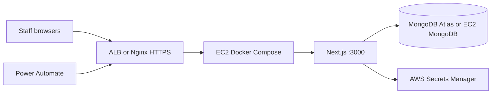

<Note>
  **Current production** runs on Vercel. This guide describes the **target AWS topology** for EC2 deployment. The full export version (for AWS Solutions Architects) lives in the repo at `docs/aws-deployment-architecture.md`.
</Note>

## Recommended topology



| Layer | Recommendation |
| --- | --- |
| Compute | EC2 (Amazon Linux 2023 or Ubuntu 22.04), Docker + Compose |
| App | Next.js production container (`next build` → `next start`) |
| Database | **MongoDB Atlas** (simplest) or self-managed MongoDB on EC2 + EBS |
| TLS | **ALB + ACM** (preferred) or Nginx + Let's Encrypt on EC2 |
| Secrets | AWS Secrets Manager or SSM Parameter Store |
| Logs | CloudWatch Logs (`awslogs` Docker driver) |

<Warning>
  Do not commit `.env.production` or real secrets to Git. Inject secrets at deploy time from Secrets Manager.
</Warning>

## Docker quick start

From the repository root on EC2:

```bash
cp .env.production.example .env.production
# Edit .env.production — load values from Secrets Manager

docker compose up -d --build
curl http://localhost:3000/api/health
```

**Production compose** (`docker-compose.yml`) runs the app only — point `MONGODB_URI` at Atlas or an external MongoDB host.

**Local stack with MongoDB** (`docker-compose.dev.yml`):

```bash
docker compose -f docker-compose.dev.yml up -d --build
```

Files in the repo: `Dockerfile`, `.dockerignore`, `docker-compose.yml`, `docker-compose.dev.yml`.

## Required environment variables

| Variable | Description |
| --- | --- |
| `MONGODB_URI` | MongoDB connection string |
| `NEXTAUTH_SECRET` | Random secret for JWT session cookies |
| `NEXTAUTH_URL` | Public HTTPS URL, e.g. `https://labels.example.gov` |
| `NEXT_PUBLIC_APP_URL` | Same public URL — used in printed labels |
| `NODE_ENV` | `production` |
| `SYNC_API_KEY` | Bearer token for Power Automate sync API |

### Optional

| Variable | Description |
| --- | --- |
| `EMAIL_VALIDATION_API_KEY` | Email validation service |
| `THOUGHTSPOT_*` / `NEXT_PUBLIC_THOUGHTSPOT_*` | ThoughtSpot embed |
| `EMAIL_SERVER` / `EMAIL_FROM` | SMTP |

## Networking

| Port | Service | Exposure |
| --- | --- | --- |
| **443** | HTTPS | Public (ALB or Nginx) |
| **80** | HTTP | Redirect to 443 only |
| **3000** | Next.js | **Internal only** — ALB → EC2:3000 |

**Security groups (summary)**

- ALB: inbound 443 from org IP range or `0.0.0.0/0`; outbound to app EC2 on 3000
- App EC2: inbound 3000 from ALB SG; outbound 27017 to MongoDB, 443 for external APIs
- MongoDB EC2 (if self-hosted): inbound 27017 from app EC2 SG only

## ALB health check

| Setting | Value |
| --- | --- |
| Path | `/api/health` |
| Success codes | `200` |
| Interval | 30s |

Use `/api/health/deep` for monitoring and paging — it returns **503** when MongoDB or core env is unhealthy (avoid using it as the ALB check if optional integrations cause flapping).

## EC2 sizing (starting point)

| Workload | Instance | Notes |
| --- | --- | --- |
| Pilot | `t3.small` | ~10 concurrent users |
| Production | `t3.medium` or `m7i-flex.large` | Print/generation spikes |

Current MongoDB footprint is ~2–3 MB — compute matters more than storage.

## Migration from Vercel

<Steps>
  <Step title="Deploy on staging EC2">
    Build and run Docker with the same `MONGODB_URI` (Atlas) or a restored dump.
  </Step>
  <Step title="Copy secrets">
    Move env vars from Vercel to AWS Secrets Manager. Set `NEXTAUTH_URL` to the new HTTPS domain.
  </Step>
  <Step title="Validate">
    Sign in, intake, print, and sync smoke test: `GET /api/sync/v1/students?limit=1` with Bearer token.
  </Step>
  <Step title="Update Power Automate">
    Change `stlabel_SyncApiBaseUrl` to the new AWS URL. Rotate `SYNC_API_KEY` if needed.
  </Step>
  <Step title="Cut over DNS">
    Point Route 53 to ALB or Elastic IP. Decommission Vercel after soak period.
  </Step>
</Steps>

**Database move (if leaving Atlas):**

```bash
mongodump --uri="$MONGODB_URI" --db=student-label --archive=student-label.archive
mongorestore --uri="$NEW_MONGODB_URI" --archive=student-label.archive --nsInclude='student-label.*'
```

## MongoDB on AWS — options

| Option | When to use |
| --- | --- |
| **Keep MongoDB Atlas** | Fastest migration; VPC peering to EC2 |
| **Self-hosted on EC2 + EBS** | Policy requires data in your AWS account |
| **Amazon DocumentDB** | Verify compatibility first — not fully MongoDB-identical |

## Open questions for AWS

1. Atlas + VPC peering vs self-managed MongoDB?
2. ALB + ACM vs Nginx on EC2?
3. Single EC2 vs Auto Scaling Group (min 2)?
4. WAF / IP allowlisting for DOE networks?
5. CI/CD: GitHub Actions → ECR → EC2?

<CardGroup cols={2}>
  <Card title="System architecture" icon="diagram-project" href="/contributors/system-architecture">
    Stack, modules, and integration overview.
  </Card>
  <Card title="Architecture export (repo)" icon="file-lines" href="https://github.com/jjaramillodoe/student-label-system/blob/main/docs/aws-deployment-architecture.md">
    Full architecture markdown for AWS Solutions Architects (`docs/aws-deployment-architecture.md`).
  </Card>
</CardGroup>

## Production reference

| Item | Value |
| --- | --- |
| Current URL | [nycadultedlabels.nyc](https://nycadultedlabels.nyc) |
| GitHub | `jjaramillodoe/student-label-system` |
| Database | MongoDB, database `student-label` |
