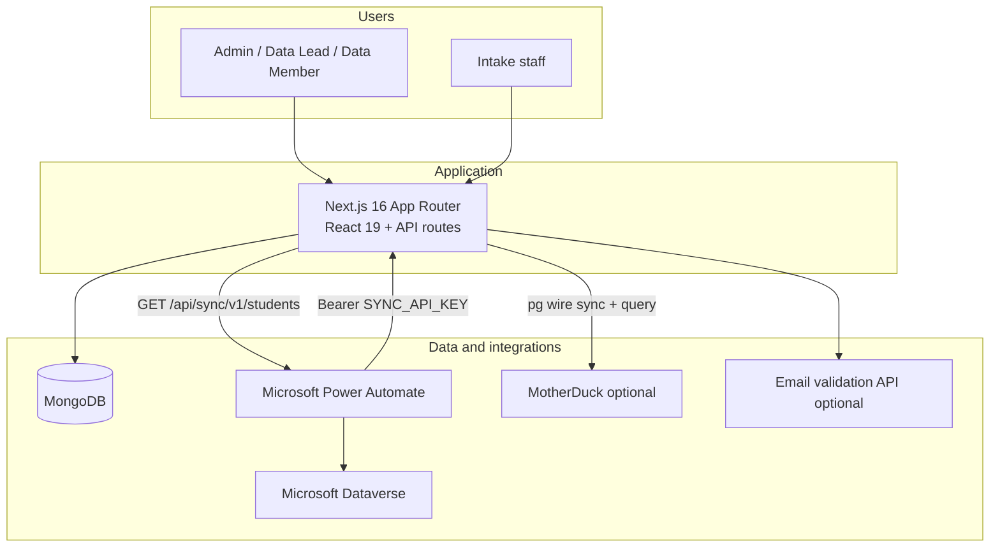

<Note>
  This page is for **contributors, DevOps, and cloud architects**. Staff day-to-day guides live in the other sections. Do not put production secrets in documentation — use environment variable **names** only.
</Note>

The Student Label System is a **single Next.js application** (UI + REST API in one Node.js process). Persistent data lives in **MongoDB** (`student-label` database). Sessions use **NextAuth JWT cookies** — the app tier is stateless.

## System context



## Stack

| Layer | Technology |
| --- | --- |
| Runtime | Node.js 20 LTS |
| Framework | Next.js 16, React 19, TypeScript |
| Database | MongoDB 6.x (native driver, no ORM) |
| Auth | NextAuth.js v4 — credentials, JWT (12h), TOTP MFA, lockout, `auth_events` |
| UI | Tailwind CSS, shadcn/ui (Radix), app shell (`AppShell` / `AppSidebar`) |
| Hosting | Vercel — production [nycadultedlabels.nyc](https://nycadultedlabels.nyc) (+ school subdomains) |
| API docs | OpenAPI 3.0 — `/api/openapi.json`, Swagger UI at `/docs/api` in the app |

There is **no Redis**, **no message queue**, and **no separate backend service**.

## Major modules

| Module | App routes | Purpose |
| --- | --- | --- |
| Authentication | `/auth/signin`, `/api/auth/*`, `/admin/security` | Login, MFA, 12h JWT sessions, auth event log |
| App shell | `AppShell`, `navConfig` | Left sidebar for Admin / Data Lead / Data Member |
| Intake | `/intake`, `/api/intake/*` | Student registration at front desk (no sidebar) |
| Students | `/api/students`, `/admin/students/*` | CRUD, bulk upload, lookup |
| Storage | `/admin/cabinets`, `/api/cabinets/*` | Cabinets, drawers, archive boxes |
| Printing | `/api/print/*` | Avery 5163 labels, print history |
| Admin | `/admin/*` | Enrollment, duplicates, settings, users |
| Tenant host | middleware + `/api/tenant` | School subdomain portals |
| Geo wall | middleware + `/geo-blocked` | Production: New York State only (`GEO_RESTRICT_NY`; bypasses cron/sync/health) |
| Sync export | `/api/sync/v1/students` | Delta export for Power Automate → Dynamics |
| Health | `/api/health`, `/api/health/deep` | Liveness and readiness probes |

The repository has **59 API route handlers** under `src/app/api/`.

## MongoDB collections

| Collection | Purpose |
| --- | --- |
| `students` | Core records, placement, archive metadata (~4,400 docs) |
| `cabinets` | Cabinet/drawer structure and capacity |
| `users` | Accounts (bcrypt passwords, MFA, lockout fields) |
| `auth_events` | Sign-in failures, lockouts, MFA disable, user created |
| `school_config` | Per-school intake settings |
| `audit_logs` | User action trail |
| `print_history` | Label print events |
| `app_settings` | Global feature toggles |
| `sync_export_log` | Last Power Automate export (90-day retention) |

Sync relies on `updatedAt` for delta queries. See the repo file `docs/mongodb-students-schema-audit.md` for schema detail.

## Authentication models

| Model | Examples | Caller |
| --- | --- | --- |
| Public | `/api/health`, `/api/openapi.json` | Load balancers, monitors |
| NextAuth session (cookie) | Most `/api/students`, `/api/cabinets`, `/api/admin/*` | Browser users |
| Bearer `SYNC_API_KEY` | `/api/sync/v1/students` | Power Automate |

## External integrations

| Integration | Direction | Notes |
| --- | --- | --- |
| MongoDB | App → database | Required — `MONGODB_URI` |
| Power Automate | Inbound HTTP to app | Nightly student sync to Dataverse |
| MotherDuck | App → warehouse (Postgres wire) | Optional analytics — `MOTHERDUCK_TOKEN` |
| Email validation | App → external API | Optional — `EMAIL_VALIDATION_API_KEY` |

Power Automate calls:

```http
GET /api/sync/v1/students?since=<ISO8601>&limit=500
Authorization: Bearer <SYNC_API_KEY>
```

See `docs/power-automate-nightly-sync.md` in the GitHub repository for the full Power Automate wiring guide.

## User roles

| Role | Scope |
| --- | --- |
| **Admin** | All schools, users, system settings |
| **Data Lead** | One assigned school — intake settings, school data |
| **Data Member** | One school — daily student and cabinet work |

## Health endpoints

| URL | Use |
| --- | --- |
| `GET /api/health` | **Liveness** — use for load balancer health checks |
| `GET /api/health/deep` | **Readiness** — MongoDB, env vars, integration config (Admin session or Bearer `HEALTH_PROBE_SECRET` / `CRON_SECRET`) |
| `GET /docs/api` | Interactive Swagger UI (in-app) |

<CardGroup cols={2}>
  <Card title="AWS deployment" icon="server" href="/contributors/aws-deployment">
    Docker Compose on EC2, TLS, secrets, migration from Vercel.
  </Card>
  <Card title="API health checks" icon="heart-pulse" href="https://nycadultedlabels.nyc/api/health/deep">
    Live deep health JSON (production).
  </Card>
</CardGroup>

## Repository layout

```text
student-label-system/
├── src/app/          # Pages + API routes
├── src/components/   # React UI
├── src/lib/          # MongoDB, auth, sync, health
├── scripts/          # One-off DB/admin scripts
├── docs/             # Mintlify + internal markdown
├── Dockerfile
└── docker-compose.yml
```

## Related docs

- [AWS deployment](/contributors/aws-deployment) — EC2 + Docker guide
- [Analytics](/admin/analytics) — in-app + MotherDuck warehouse
- [Local preview](/contributors/local-preview) — run Mintlify docs locally
- Repo: `docs/api-health.md`, `docs/mongodb-students-schema-audit.md`
