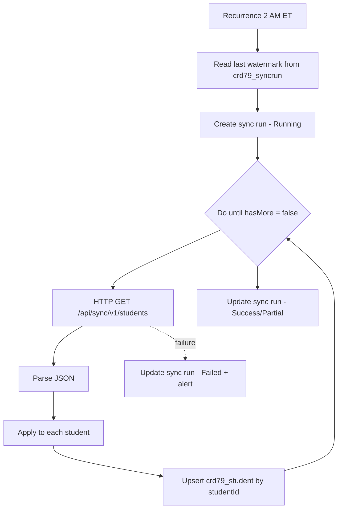

# Power Automate — Nightly Student Sync Flow

Wire **Power Automate** to call `GET /api/sync/v1/students` and upsert rows into **Dataverse** (`crd79_student`).

Companion docs:

- [power-platform-sync-prompts.md](./power-platform-sync-prompts.md) — Dataverse table Copilot prompts
- [mongodb-students-schema-audit.md](./mongodb-students-schema-audit.md) — source schema & indexes

---

## Prerequisites checklist

| Item | Status |
|------|--------|
| Sync API deployed (Vercel) with `SYNC_API_KEY` set | |
| Dataverse table `crd79_student` created with **alternate key** on `crd79_studentid` | |
| Dataverse table `crd79_syncrun` created (optional but recommended) | |
| Power Automate premium license (HTTP + Dataverse connectors) | |
| Service account / connection with write access to Dataverse tables | |

**Production URL:**

```text
https://nycadultedlabels.nyc/api/sync/v1/students
```

Live app: [nycadultedlabels.nyc](https://nycadultedlabels.nyc/)

---

## Step 0 — Store secrets in Power Automate Environment Variables

In **Power Platform admin center → Environments → your env → Settings → Environment variables**:

| Display name | Schema name | Type | Example |
|--------------|-------------|------|---------|
| Student Label Sync API Base URL | `stlabel_SyncApiBaseUrl` | Text | `https://nycadultedlabels.nyc` |
| Student Label Sync API Key | `stlabel_SyncApiKey` | Secret | *(same as `SYNC_API_KEY` in Vercel)* |

Add both to your **solution** so the flow can reference them.

In flow actions, reference as:

```text
@{parameters('stlabel_SyncApiBaseUrl (stlabel_stlabel_SyncApiBaseUrl)')}
@{parameters('stlabel_SyncApiKey (stlabel_stlabel_SyncApiKey)')}
```

*(Exact parameter label varies by solution prefix — pick the env var from the dynamic content picker.)*

---

## Step 1 — Create the cloud flow

1. Go to [make.powerautomate.com](https://make.powerautomate.com)
2. **Create → Automated cloud flow**
3. Name: `Student Label → Dynamics Nightly Sync`
4. Trigger: **Recurrence**
   - Interval: `1`
   - Frequency: `Day`
   - Time zone: `(UTC-05:00) Eastern Time`
   - At: `2:00 AM`
   - On these days: Mon–Sun

---

## Step 2 — Initialize variables

Add **Initialize variable** actions:

| Name | Type | Initial value |
|------|------|---------------|
| `varWatermark` | String | *(see Step 3)* |
| `varCursor` | String | *(empty)* |
| `varHasMore` | Boolean | `true` |
| `varProcessed` | Integer | `0` |
| `varFailed` | Integer | `0` |
| `varMaxModified` | String | *(empty — tracks highest `sourceLastModified` in run)* |
| `varSyncRunId` | String | *(empty)* |

---

## Step 3 — Read last watermark from Dataverse

Add **Dataverse → List rows**:

- **Table:** `District79 Sync Runs` (`crd79_syncrun`)
- **Filter rows:** `crd79_status eq 100000001` *(adjust — use your **Success** choice value; see note below)*
- **Sort by:** `crd79_completedat` descending
- **Top count:** `1`

Add **Compose** (optional) or **Set variable** `varWatermark`:

```text
@if(
  empty(first(outputs('List_rows')?['body/value'])),
  addDays(utcNow(), -1),
  first(outputs('List_rows')?['body/value'])?['crd79_watermarkafter']
)
```

**First run fallback:** If no prior sync run exists, use yesterday UTC:

```text
addDays(startOfDay(utcNow()), -1)
```

> **Choice values:** In Power Automate, status choices are numeric (`100000000` = Running, etc.). After creating `crd79_syncrun`, open the column in Dataverse and note the integer for **Success**, then use it in the filter. Alternatively filter in a **Filter array** action on `crd79_status` label.

---

## Step 4 — Create a sync run row (Running)

**Dataverse → Add a new row** → `crd79_syncrun`:

| Column | Value |
|--------|-------|
| `crd79_flowname` | `Student Label → Dynamics Nightly Sync` |
| `crd79_startedat` | `utcNow()` |
| `crd79_status` | Running *(choice)* |
| `crd79_watermarkbefore` | `variables('varWatermark')` |
| `crd79_recordsprocessed` | `0` |
| `crd79_recordsfailed` | `0` |

**Set variable** `varSyncRunId` → **Row ID** from this action.

---

## Step 5 — Pagination loop (`Do until`)

Add **Do until**:

- **Condition:** `@equals(variables('varHasMore'), false)`

Inside the loop:

### 5a — HTTP GET students

**Action:** HTTP (Premium)

| Field | Value |
|-------|-------|
| Method | `GET` |
| URI | See expression below |
| Headers | `Authorization`: `Bearer @{parameters('...SyncApiKey...')}` |
| | `Accept`: `application/json` |

**URI expression** (paste in advanced mode):

```text
concat(
  parameters('stlabel_SyncApiBaseUrl'),
  '/api/sync/v1/students?since=',
  uriComponent(variables('varWatermark')),
  '&limit=500',
  if(empty(variables('varCursor')), '', concat('&cursor=', uriComponent(variables('varCursor'))))
)
```

**Settings → Configure run after:** If HTTP fails, go to Step 8 (error scope) instead of continuing.

### 5b — Parse JSON

**Parse JSON** on **Body** from HTTP:

Use **Generate from sample** with this payload:

```json
{
  "students": [
    {
      "studentId": "JARAMILLOJAVIEREUGENIOR0820260529",
      "labelId": "2026-JJ-0000001",
      "firstName": "Javier",
      "lastName": "Jaramillo",
      "dob": "1990-01-15",
      "email": null,
      "phone": null,
      "gender": null,
      "school": "District 79",
      "agencyId": "R08",
      "fiscalYear": "2025-2026",
      "status": "Active",
      "program": null,
      "startDate": "2026-01-01",
      "endDate": null,
      "archived": false,
      "intakeStudentStatus": null,
      "educationStatus": null,
      "placementClass": null,
      "notes": null,
      "siblingFlag": false,
      "intakeVisits": [],
      "sourceMongoId": "6a1a177b4368ee9a30170743",
      "sourceLastModified": "2026-05-30T00:21:20.617Z"
    }
  ],
  "hasMore": false,
  "nextCursor": null,
  "since": "2026-01-01T00:00:00.000Z",
  "count": 1
}
```

### 5c — Apply to each student

**Apply to each** → `body('Parse_JSON')?['students']`

Inside **Apply to each**:

#### Option A — Upsert (recommended if available)

**Dataverse → Perform an unbound action** or **Upsert a row** *(connector version dependent)*:

- Table: `crd79_student`
- Alternate key: `crd79_studentid`
- Key value: `items('Apply_to_each')?['studentId']`

Map columns:

| Dataverse column | Power Automate expression |
|------------------|---------------------------|
| `crd79_studentid` | `items('Apply_to_each')?['studentId']` |
| `crd79_labelid` | `items('Apply_to_each')?['labelId']` |
| `crd79_firstname` | `items('Apply_to_each')?['firstName']` |
| `crd79_lastname` | `items('Apply_to_each')?['lastName']` |
| `crd79_dob` | `items('Apply_to_each')?['dob']` |
| `crd79_email` | `items('Apply_to_each')?['email']` |
| `crd79_phone` | `items('Apply_to_each')?['phone']` |
| `crd79_school` | `items('Apply_to_each')?['school']` |
| `crd79_agencyid` | `items('Apply_to_each')?['agencyId']` |
| `crd79_fiscalyear` | `items('Apply_to_each')?['fiscalYear']` |
| `crd79_status` | `items('Apply_to_each')?['status']` |
| `crd79_program` | `items('Apply_to_each')?['program']` |
| `crd79_startdate` | `items('Apply_to_each')?['startDate']` |
| `crd79_enddate` | `items('Apply_to_each')?['endDate']` |
| `crd79_archived` | `items('Apply_to_each')?['archived']` |
| `crd79_intakestudentstatus` | `items('Apply_to_each')?['intakeStudentStatus']` |
| `crd79_educationstatus` | `items('Apply_to_each')?['educationStatus']` |
| `crd79_placementclass` | `items('Apply_to_each')?['placementClass']` |
| `crd79_notes` | `items('Apply_to_each')?['notes']` |
| `crd79_siblingflag` | `items('Apply_to_each')?['siblingFlag']` |
| `crd79_sourcemongoid` | `items('Apply_to_each')?['sourceMongoId']` |
| `crd79_sourcesystem` | `StudentLabelSystem` |
| `crd79_sourcelastmodified` | `items('Apply_to_each')?['sourceLastModified']` |
| `crd79_lastsyncedat` | `utcNow()` |

#### Option B — List + Condition + Update/Add (works everywhere)

1. **List rows** `crd79_student`  
   Filter: `crd79_studentid eq '@{items('Apply_to_each')?['studentId']}'`  
   Top: `1`

2. **Condition:** `length(body('List_rows_2')?['value'])` is greater than `0`

3. **If yes → Update a row** (Row ID from list) — same column map as above

4. **If no → Add a new row** — same column map

**Configure run after (inside Apply to each):**

- On success: **Increment variable** `varProcessed` by `1`
- Track max modified:

```text
@if(
  or(
    empty(variables('varMaxModified')),
    greater(items('Apply_to_each')?['sourceLastModified'], variables('varMaxModified'))
  ),
  items('Apply_to_each')?['sourceLastModified'],
  variables('varMaxModified')
)
```

Use **Set variable** `varMaxModified` with that expression after each successful upsert.

- On failure: **Increment variable** `varFailed` by `1` (configure run after → has failed)

### 5d — Advance pagination

After **Apply to each**, still inside **Do until**:

**Set variable** `varHasMore`:

```text
body('Parse_JSON')?['hasMore']
```

**Set variable** `varCursor`:

```text
coalesce(body('Parse_JSON')?['nextCursor'], '')
```

---

## Step 6 — Mark sync run Success

After **Do until** completes:

**Dataverse → Update a row** → `crd79_syncrun` (Row ID = `varSyncRunId`):

| Column | Value |
|--------|-------|
| `crd79_completedat` | `utcNow()` |
| `crd79_status` | Success |
| `crd79_recordsprocessed` | `variables('varProcessed')` |
| `crd79_recordsfailed` | `variables('varFailed')` |
| `crd79_watermarkafter` | `@if(empty(variables('varMaxModified')), variables('varWatermark'), variables('varMaxModified'))` |
| `crd79_runurl` | Link from flow run *(optional: `concat('https://make.powerautomate.com/environments/', ...)`)* |

**Condition for Partial status:** If `varFailed` > 0 and `varProcessed` > 0, set status to **Partial** instead of Success.

---

## Step 7 — Error handling scope

Add a **Scope** named `On failure` at the flow level:

- Configure the main sync scope to **run after** previous step **has failed** or **has timed out**

Inside `On failure`:

1. **Update a row** `crd79_syncrun`:
   - `crd79_status` = Failed
   - `crd79_completedat` = `utcNow()`
   - `crd79_errormessage` = `result('HTTP')?['body']` or `actions('HTTP')?['error']?['message']`

2. **Send an email (V2)** or **Post message in Teams** to district admins

---

## Step 8 — Test before enabling schedule

### Manual test (10 records)

1. Temporarily change Recurrence to **Manually trigger**
2. Set `varWatermark` to fixed value: `2026-05-29T00:00:00.000Z`
3. Set HTTP `limit=10` in URI for first test
4. Run flow → verify rows in `crd79_student` in Power Apps / Dataverse

### curl equivalent (same call Power Automate makes)

```bash
curl -s -H "Authorization: Bearer $SYNC_API_KEY" \
  "https://nycadultedlabels.nyc/api/sync/v1/students?since=2026-05-29T00:00:00.000Z&limit=10"
```

Expected: HTTP 200, JSON with `students` array, `hasMore`, `nextCursor`.

### Common HTTP errors

| Status | Cause | Fix |
|--------|-------|-----|
| 401 | Wrong/missing Bearer token | Match Vercel `SYNC_API_KEY` to env var secret |
| 503 | `SYNC_API_KEY` not set on server | Add to Vercel env, redeploy |
| 400 | Bad `since` or `cursor` | Use ISO-8601; URL-encode cursor |
| 500 | MongoDB connection | Check Vercel `MONGODB_URI` |

---

## Flow diagram



---

## Phase 2 — Intake visits (optional)

After students sync reliably, add an inner **Apply to each** on:

```text
items('Apply_to_each')?['intakeVisits']
```

Upsert `crd79_intakevisit` using composite key:

- Parent lookup: resolve `crd79_student` row by `studentId` from outer loop
- `crd79_sourcevisitindex` = `items('Apply_to_each_2')?['sourceVisitIndex']`
- `crd79_intakeactivity` = `join(items('Apply_to_each_2')?['intakeActivity'], ', ')`

---

## Copilot prompt (paste in Power Automate Copilot)

```text
Build a scheduled cloud flow named "Student Label → Dynamics Nightly Sync" that runs daily at 2:00 AM Eastern.

Use environment variables for API base URL and Bearer token secret.

1. Read the latest successful watermark from Dataverse table crd79_syncrun (column crd79_watermarkafter). If none, use start of yesterday UTC.
2. Insert crd79_syncrun with status Running.
3. Do until hasMore is false:
   - HTTP GET {baseUrl}/api/sync/v1/students?since={watermark}&limit=500&cursor={cursor if set}
   - Header Authorization: Bearer {secret}
   - Parse JSON with fields: students[], hasMore, nextCursor, since, count
   - For each student, upsert crd79_student using alternate key crd79_studentid
   - Map: studentId, labelId, firstName, lastName, dob, email, phone, school, agencyId, fiscalYear, status, program, startDate, endDate, archived, intakeStudentStatus, educationStatus, placementClass, notes, siblingFlag, sourceMongoId, sourceLastModified; set crd79_sourcesystem=StudentLabelSystem and crd79_lastsyncedat=utcNow()
   - Set cursor=nextCursor and hasMore from response
4. Update crd79_syncrun with Success or Partial, record counts, watermarkafter = max sourceLastModified seen.
5. On failure, set status Failed, store error message, email admins.

Skip intake visits for v1.
```

---

## Related rollout steps

| Step | Doc |
|------|-----|
| Dataverse tables | [power-platform-sync-prompts.md](./power-platform-sync-prompts.md) Prompts 1, 2, 5 |
| Sync API | `src/app/api/sync/v1/students/route.ts` |
| Indexes & backfill | `npx tsx scripts/setup-students-sync.ts` |
